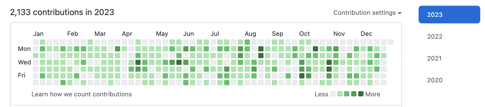
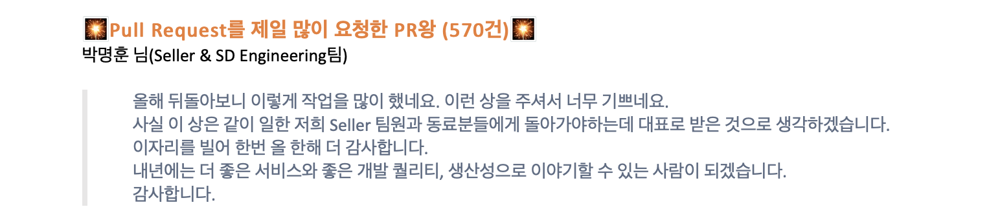
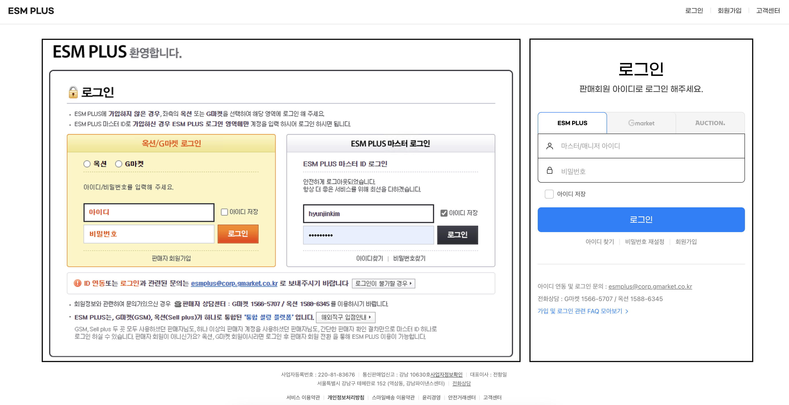
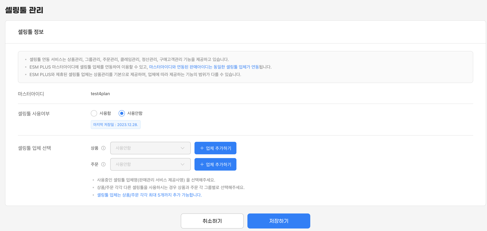
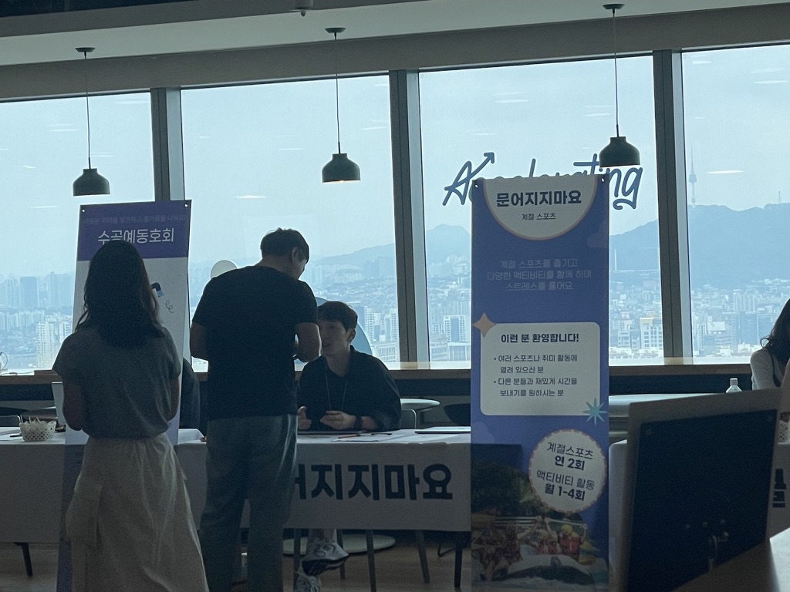
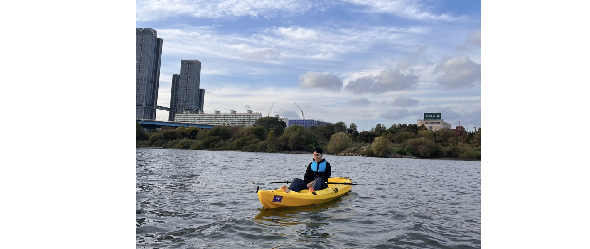
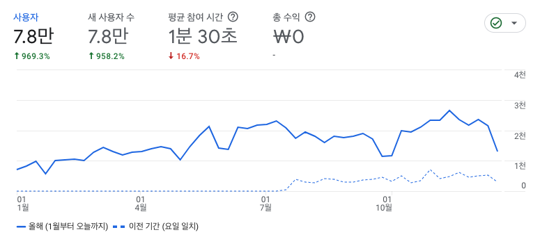
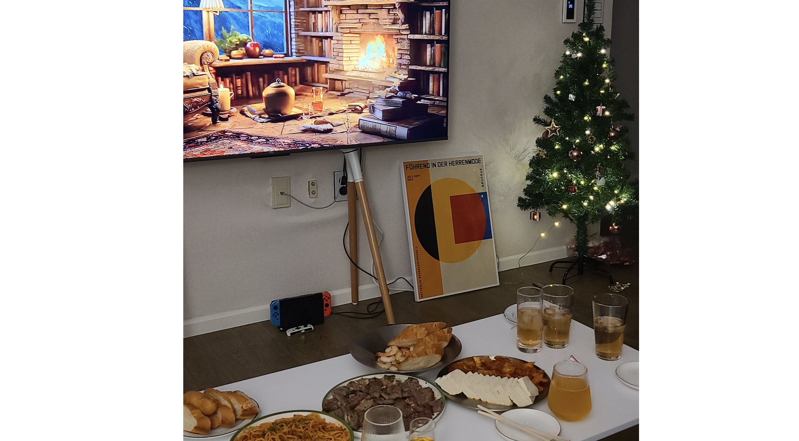
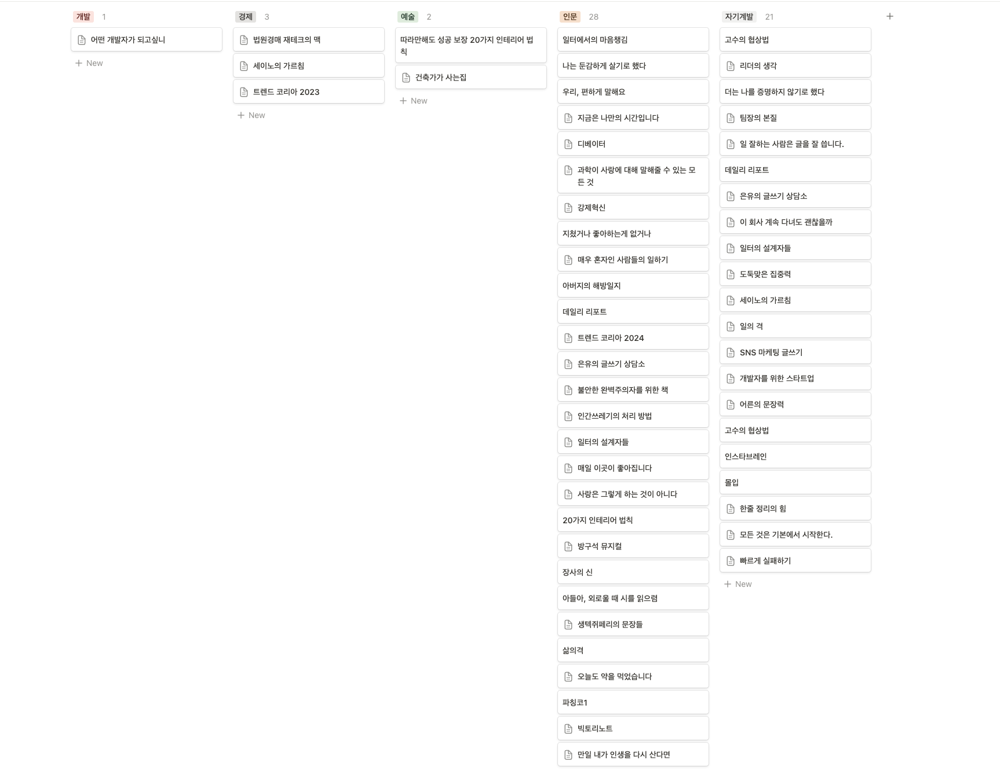

# 2023 년 회고 및 2024년 목표

## 지난 2023년

 올 한해도 바쁘게 흘러갔다. 매년 더 빨라지는 한 해가 되는 것을 느끼지만, 올해는 더 성장한 능력으로 더 기억에 남는 한 해가 되는 것 같다. 올해도 더 성장했고, 좋은 결과를 내기 위해 노력했다. **워라밸(Work-Life balance)과 달리 워라인(Work-Life Integration)** 이라는 말이 있다. 일과 삶의 경계가 따로 없이 자유롭게 업무를 진행하는 것을 의미하며, 올 한해 삶을 워라인이라 표현할 수 있을 것 같다.

 올 한해의 중심은 회사였다. 30살이 되기 전에 회사에서 정말 목숨 걸고 부딪히고 싶었고, 더 잘하고 싶었다. 누군가는 거쳐 가는 곳이라 말하더라도 때로는 열정이라는 낭만을 느끼고 싶다. **한 번은 최선을 다해서 업무에 부딪혀야 앞으로 내 삶이 미련이 없을 것이라 믿는다.** 뒤돌아봤을 때 아쉬움이 없었으면 하는 욕심으로 한 해를 보냈다. 올해가 최고의 결과는 아닐지라도 최선에는 가까웠다고 생각하기에 만족하는 한 해가 되었다.

  

### 개발자로서, 직장인으로서

업무를 하면서 가장 고민했던 부분은 “**어떻게 개발자로서 성과를 낼 수 있을까**”라는 생각이었다. 일정 연봉을 받을 때 과연 연봉의 5~10배 정도의 생산성이 있는 일을 할 수 있겠느냐고 고민한다. 돈을 벌기 위해서는 가치를 증명해야 한다고 생각하고, 열심이라는 말로는 변명할 수 없이 결과로 증명해야 하는 시대가 오고 있음을 느낀다.

올해 개인적인 회사에서의 방향은 기술자보다는 비즈니스적 방향이었고, 스페셜리스트보다는 제너럴리스트에 가까웠다. 어떤 일이든지 할 수 있는 사람이 되고 싶었고 정답지가 없는 문제를 풀어가는 과정의 사람이었다. 정해진 길보다는 창작의 문제가 많았고 설계나 아이디어를 많이 냈던 기억이고 그렇기에 행복한 한 해였다.

올해 여름부터 개인 개발보다는 회사 개발로 공부했다. 개인 톤이 프로젝트 대신에, 회사에 새로운 서비스를 만들기 위해 시도를 했다. **기존의 시스템과 신규 시스템을 새로 설계하고 그렸으며, 리팩터링과 마이그레이션 작업도 취미로 했다.** 그래서 회사 개발 커밋으로 2,100개 정도를 했고, 365일 중에 주말을 포함한 320일 정도는 꾸준하게 개발했다. PR로도 500개가 넘었고, 올해 회사에서 가장 많은 PR을 한 사람이 되었다. 물론 다른 부분도 한 손에 꼽을 정도로 일을 많이 했다. 이보다도 더 잘하고 싶었으나, 역설적으로 더 잘하는 사람과 더 열심히 하는 사람을 통해 부족함을 느끼기도 했다.

이렇게 일을 많이 할 수 있었던 것은 내가 가지고 있던 책임도 커서 할 수 있는 부분이 많았다. 특히 연초부터 지마켓과 옥션의 판매 상품을 담당하는 ESMPLUS 사이트의 개편이 있었고, 그 개편 중 큰 역할을 내가 수행하고 있었기 때문에 가능했다고 생각했다. 로그인 서비스부터 판매자 관련 서비스, 인증 툴에 대한 개편 등을 진행하면서 기존의 시스템을 다시 짤 기회가 있었고 더 좋은 퀄리티의 프로덕트를 만들기 위해 노력했다. 즉 **시간만 좀 더 투자한다면 더 나은 결과를 만들 수 있는 축복이 있었다.** 레거시가 심했던 .NET(with Razor) 프로젝트에서 Java 와 React(Next.js) 의 서비스로 바꾸면서 70% 정도의 전환을 이뤄냈다. 그러한 과정 중에서 많은 언어나 기술적 성장도 했으며, 분석의 능력이나 아키텍처 능력도 많이 늘었다. 코드양으로만 봤을 때 몇백만 줄 정도는 작업했을 것 같다. 특히 욕심이 될지도 모르는 길을 같이 고생한 팀원에게 너무 감사함을 느낀다.

구버전 ESMPLUS와 새로운 ESMPLUS 로그인 페이지.

ESMPLUS 개편은 UI/UX 개편이 메인으로 보이지만, 안쪽에서 보면 더 디테일하고 미래를 그리는 서비스를 준비하고 있다. 이후의 확장성을 위해 로그인 서비스를 분리하고 인증/인가 서비스에도 많은 준비를 했다. 그리고 불필요한 동선을 정리하면서 많은 규격화를 했다. 15년 동안 쌓인 레거시 서비스를 내 선에서 끊은 것도 많은 기쁨을 주었다.

> 먼저 반영된 페이지 (새로운 기능들이 있어서). 내년에는 더 깔끔해질 예정.

이러한 개편을 진행하면서 기존에 있었던 수많은 레거시 프로젝트도 정리했다. 각 팀의 좋은 코드도 많이 가져오고, 많은 서비스를 보며 많이 배웠다. **잘하는 사람에게 배움을 청했고 업무적으로 관련이 없는 팀에 대한 프로젝트를 40개 이상 봤으며 각 팀에 설계를 문서를 보며 공부하고 또 적용했다.** 그리고 많은 팀에서 진행하는 프로젝트를 보며, 설계를 고민하고 어떤 비즈니스를 바탕으로 좋은 서비스를 만들려고 하는지 배웠다. 기술적으로 프론트에 대한 부족한 지식도 많았지만, 올해 동안 프론트 구조를 고민하고 설정하고, 개발하면서 많은 경험을 얻었다. 어떤 서비스의 시작부터 끝까지 프론트엔드, 백엔드, 데브옵스를 다 개발할 수 있어서 너무 좋았고 힘들었으나 덕분에 성장했다.

더 나아가 일정 관리나 외주 관리 등 매니징에 대한 부분도 많이 배운 한 해였다. 셀러 워킹 그룹을 이끌며 팀장님의 부담을 줄이고, 판단이 팀장님과 동료와 같은 방향을 대변할 수 있도록 노력했다. 같은 방향을 보는 방법을 배우기 위해 노력했고, 개발자가 아닌 프로젝트 리더로서 어떤 역할을 수행해야 할지 고민했다. 올 한해가 너무 바쁘다 보니 외주 분들도 들어왔는데, 프로젝트의 퀄리티와 일정을 어떻게 잘 맞춰야 하는지도 느꼈다. 지나가 보니 더 아쉬운 부분도 많지만, 책임감을 주는 방법을 배운 것이 가장 큰 수확이라고 느낀다.

 

### 회사에서 나의 길을 가기

개발자로서가 아닌 회사를 좋아하는 직장인으로서도 여러 일이 많았다. **팀을 넘어 회사에 긍정적인 크랙을 줄 수 있는 사람이 되기 위해 노력했다**. 올해도 여전히 블로그를 준비했고 여러 행사도 준비하고, 기술문화 관련으로 새로운 일을 시작하고 동호회를 운영하기 시작했다.

 회사에서 자발적인 조직으로 기술문화를 성장하는 데 노력하는 PAWS라는 그룹이 있고 이 그룹에 새롭게 들어가서 문화 관련해서 콘텐츠를 준비했다. 개발자의 문화를 성장시키고, 여러 팀이 공유하는 문화와 기술적인 콘텐츠를 내부적으로 이야기하는 그룹이다. 올해는 좀 더 성장하는 방법을 고민하고 있다. 올해 마지막을 정리하며 자체적으로 어워드를 준비했다. 더 나아가 내년에는 직원들에게 보람이 있는 조직문화를 줄 수 있는 그룹이 될 수 있을 것 같다.

작년에 이어 올해도 행사를 준비했다. 조직 해커톤이 아니라 전사 해커톤의 크기로 좀 더 커졌으며, 여러 팀과 영업, 마케팅, 지원 본부의 다양한 사람들과 함께 행사를 준비할 수 있는 기회가 있었다. 함께 행사를 준비하면서 각 본부 사람의 방향성과 고민, 인사이트를 배웠다. 덕분에 좀 더 열린 생각을 가질 수도 있었다. 멋진 사람들에게 언제나 감사한다.

2023년 한 해의 마무리, 해커톤

올 한해 조용히 살고 싶다고 노래를 불렀지만 새로운 일이 많이 생겼다. 올해 하반기부터 코로나 시대가 끝나고 동호회를 운영할 수 있게 되었다. 주변에 많은 동료를 새로 알게 되면서 조금 더 가까워질 수 있는 그룹이 필요하게 되었고, 주변 사람들과 함께 동호회를 만들고 운영하게 되었다. 작게 시작하려고 했지만, 많은 분이 지원했고 다양한 활동을 하면서 재밌게 살고 있다.

> 열심히 홍보 중

동호회를 통해서 사람들이 편하게 회사에서 여러 팀과 친하게 지낼 수 있는 공간을 주고 싶었다. 계절 스포츠라는 명칭이지만 매월 하고 싶어 하는 운동이나 활동을 지원하는 동호회를 운영하고 있다. 올해는 볼링과 카약, 양궁, 등산을 했다. 내년에는 스키장을 준비하고 있는데 때로는 업무보다 어려운 부분도 많지만, 여러 사람을 만날 기회가 너무 행복하다. 각자의 방향성을 모아줄 수 있는 공간을 준다는 것은 하나의 아름다움이라고 느낀다.

올해를 마무리로 기술 블로그도 다른 분에게 넘겨주었다. 회사의 테크에디터 분들이 노력 해주신 덕분에 작년에 비해 300~400% 정도의 사용자가 늘었다. 그러나 개인적으로도 다른 책임과 업무로 집중하지 못하고 어느정도 구도에 올라와 있어 책임을 나눠줘야겠다는 생각이 들었다. 책임을 주는 일은 어렵지만 한 해의 마무리를 어려운 일을 끝낼 수 있어서 좋았다.

> 블로그 성장중, 많은 관심 부탁해요 ([dev.gmarket.com](dev.gmarket.com))

작년의 한 해는 경기가 힘들었던 한 해였다. 지마켓이라는 회사의 입지가 과거와 같지는 않지만, 그래도 주변 사람들을 보며 성장할 수 있음을 믿고 있다. 주변 사람들과 함께 여전히 회사에서 성장하고 싶은 열망이 있고, 아직은 희망이 있다고 생각하기에 더 열심히 해보고 싶다. 부딪혀보면서 배우고, 깨지고, 넘어가고 싶다.

## 개인적인 한 해

회사 외적으로 올해 가장 큰 일은 새로운 곳에 정착한 것이다. 연초부터 부동산 임장을 다녔고, 앞으로 어떻게 될지는 모르겠지만 안정된 삶을 살고 있다. 언젠가 또 이사할 수도 있겠지만, 혼자 공부하고, 부동산을 다니고, 돈을 공부한 경험이 있다는 게 도움이 되었다. 아직은 주변에 나와 같은 경험을 해본 사람이 적어서 어려움이 많았지만 반대로 다른 사람들에게 도움을 줄 수 있다는 사실이 기쁘다.

> 연말 파티 + 취미 중 하나인 요리

작년에 목표로 잡았던 책 목표는 100권을 읽고 책 메모 습관을 지니는 것이었다. 올해를 넘어오며 하반기에 여유가 없어 많이 읽지 못했다. 그래도 작년보다 더 많이 50권 정도 읽었으며 (일주일에 책은 한 권 정도는 읽었다. 네이버 시리즈나 카카오 페이지 소설을 너무 좋아하지만, 이 책은 포함하지 않겠다… 포함하면 100권이 넘겠지만 그렇게 추가하고 약속을 지키고 싶지는 않다…), 책 메모 습관도 만들고 있다. 자기개발서를 많이 읽던 2022년에 비해 조금 더 다양한 책과 인문학을 읽으면서 많은 부분을 배웠던 것 같다.

올해 책을 보면서 생각을 나눠보고 싶어서 독서 모임을 많이 다녔다. 책을 주제로 이야기하며 여러 사람과 의견을 나누면서 책을 좀 더 많이 읽게 되었고, 다양한 책을 읽을 수 있는 기회가 되었다. 하반기에 들어서는 격주로 도서관을 다니는 습관을 유지하고 있다.

독서와 함께 가장 열심히 한 취미는 노래다. 올해 녹음한 개인 녹음 파일이 700개 정도 된다. 보컬 수업을 배우고 노래방을 가서 항상 녹음하고 집에 가면서 내가 부른 노래를 들으면서 퇴근한다. 아직은 부족하지만, 많이 성장하고 있는 것을 느낀다. 화법이나 여러 발표를 하기 위해 시작했지만, 재밌음을 느끼고 성장하는 매력을 느끼고 있다.

그 외에도 올해도 다양한 경험을 얻었다. 작년의 목표 중 하나인 춤도 3개월 정도 배웠다. 노래도 배우고 춤도 배우고, 관리도 받아보고 개발자의 이상한 아이돌 코스를 탔다. 그리고 주변 사람들을 자주 초대하고 요리를 하며 실력도 많이 늘었다. 덕분에 대부분의 요리도 해줄 수 있는 사람이 되었다. 인테리어도 많이 공부하고 셀프인테리어도 했으며, 부동산도 많이 배웠다. 올해도 여러 경험이 쌓였고 더 섬세하게 성장한 곳도 많았다.

 

## 오는 2024년

2024년은 일에 대한 욕심도, 앞으로의 방향성이나, 개인적인 여유를 가진 사람이 되기를 기도한다.

### 올해를 통해 배우기.

내년에는 재택이 끝나게 되면서 본격적으로 다시 출근해야 한다. 그러면서 올해는 좀 더 게으르지 않고 부지런한 사람이 되려고 한다. 작년 한 해는 많은 도전도 했지만, 게을렀다는 아쉬움이 남는다. 후회는 하지 않지만, 반면교사 삼아 더 노력하는 삶을 살아야 함을 느낀다. 특히 새벽에 모니터링과 작업이 많아 낮 사람에서 밤 사람으로 바뀐 라이프스타일을 다시 돌리려고 한다.

올해 회사에서는 프로젝트가 너무 많고, 여유 없이 달려가는 시간이 반복했다. **동료와 함께 긴 마라톤을 달리며 어떻게 하면 지치지 않고 목표로 도달할 수 있겠느냐는 고민이 가득하다. 단순히 목표가 아닌 장기적인 방향에서 지금의 경험이 도움이 될 수 있을까 하는 생각도 가득하다.** 내년에는 이 고민이 다른 사람들에게 도움이 되는 결과로 바꿔보고 싶다. 한 해의 마무리를 돌아보니 주변 사람들이 일에 파묻혀 지내는 것을 보며 동료의 무게를 줄일 수 있는 사람이 되고 싶다.

어른이 되어가면서 개인적인 퍼포먼스만큼 주변을 잘 챙기는 것이 중요하다고 생각한다. 개발자라는 직업의 매력은 퍼포먼스를 올리면 더 많은 사람의 부담을 줄일 수 있는 직업이라고 생각한다. 조금 개인적인 퍼포먼스를 올리고, 그 올린 퍼포먼스를 주변 사람한테 도움을 줄 수 있는 사람이 되고 싶다. 내년은 실력에 대해 자신감과 부족함을 둘 다 잡아야 할 시점이라고 생각한다. 더 갈증하고 더 갈망하는 한 해가 되기를 기대한다. 그러면서 함께 주변 사람과 자신을 잘 챙기는 여유를 즐기는 사람이 되려고 한다.
 
 

### 밸런스가 가득한 2024년이 되기를

개발자로서 기술적인 부분과 함께 퍼포먼스를 바탕으로 더 나은 사람이 되고 싶다. 얻은 기술을 바탕으로 여러 발표를 할 수 있을 정도로 더 탄탄해지는 사람이 되고 싶다. 내년 1월부터 발표가 예정되어 있다. 이 시작을 바탕으로 좀 더 잘하는 방법을 배워보려고 한다.

업무적으로는 새로운 방향도 그려보고 싶다. 작년에 비해 업무에 자신감이 있었기 때문에 퍼포먼스에 자신감이 있었다. 그러나 점점 더 변화에 두려워하는 모습이 종종 보인다. 내년에도 두려움을 꺾고 꾸준하게 도전하고 부딪히고, 더 새로운 방향으로 가고 싶다. 매년 업무적으로 성장을 했다고 뒤돌아볼 수 있는 사람이 되고 싶다.

개인적인 프로젝트도 다시 좀 준비해 보려고 한다. 오픈소스도 많이 보면서 좀 더 트렌드에 밀리지 않는 사람이 되고 싶다. AI나 기술의 발전이 점점 더 빨라지는 시대가 되고 있음을 느껴 위기감을 느낀다. 앞으로의 시대의 개발자는 경쟁력이 없으면 밀릴 것이라 느낀다. 조금 더 경쟁력이 있고, 더 나은 사람이 되고 싶다.

운영하는 동호회도 내가 없어도 잘 굴러가는 구조로 만들고 싶다. 올해에는 회사의 동호회 인원이 100명이 되는 것이 목표다. 현재도 동호회 인원이 회사에서 2위다. 신생 동아리임에도 불구하고 많은 분들이 참여해 주셨다. 내년에는 동호회 인원을 100명을 넘기면서 좀 더 다양하게 지원하고, 더 규격화시키고 싶다. 더 많은 사람이 다양한 가치관을 공유할 수 있는 자리를 주고 싶다. 이를 바탕으로 회사의 팀워크와 생산성을 높여주는 사람이 되고 싶다.

작년보다 좀 더 책을 읽는 것은 항상 가지고 있는 목표이다. 올해 여름쯤에 다른 일로 여유가 없어서 많이 읽지를 못했는데 내년에는 더 많이 읽고 배우고 싶다. 더 꿈꾸는 방향은 책을 읽은 것을 바탕으로 좀 더 책을 쓰고 싶다. **올해는 60권 이상의 책을 목표로 잡으려고 한다. 그리고 기술적인 콘텐츠와 생각 정리에 대한 글도 많이 써보려고 한다.**

노래 실력도 좀 더 키워서 직장인의 꽃 중 하나인 밴드도 참여해 보고 싶다. 아직은 노래가 부족한 부분이 많지만, 조금 더 증명의 장으로 몸을 넣어보려고 한다. 언젠가는 밴드뿐만 아니라 뮤지컬이나 연극에 참여도 하고 싶다. 아주 먼 미래이지만, 재밌는 미래가 될 것 같다.

올해 놓친 숙제는 언어와 운동이다. 영어나 다른 언어를 배우겠다는 생각을 많이 하지만, 뒤돌아보면 아쉬울 때가 많다. 내년에는 좀 더 자신감을 가지고 부딪히는 경험으로 배우려고 한다. 그리고 본격적으로 다시 운동을 진행하려고 한다. 나이를 먹었는데 이전에 바디 프로필 찍었을 때보다 더 몸을 잘 만들어야지 성장했다고 말할 수 있을 것 같다.

내년이면 5년 차 개발자다. 아직은 배울 것이 많고 부족한 것이 많지만 그렇기에 더 도전하고 싶다. 30살이 되기 전까지는 아이처럼 새로운 일을 많이 저지르고 어른처럼 책임을 지고 싶다. 새로운 사람에게 많은 인사이트를 받고 또 주고 싶다. 주변 사람들 덕분에 하고 싶은 미래를 그리고 있음을 느낀다.

2024년도 지치지 말고, 즐기면서, 노력하고, 증명하자.